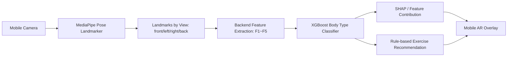

# Mobile AR Exercise Recommendation Platform Based on Explainable Body-Type Profiling

This repository is a platform-structured prototype based on the system proposed in the paper **“Explainable Body-Type Profiling-Based Mobile AR Personalized Exercise Recommendation System.”** Using posture landmarks captured from a single smartphone camera, the system calculates body-type features `F1~F5`, performs XGBoost-based body-type classification, provides SHAP-based explanations, recommends staged exercises by body type, and presents results through a mobile AR overlay interface.

> This project is a research prototype. It does not replace medical diagnosis, treatment, or rehabilitation prescription, and expert review is required before applying it to real users.


## Overall Architecture



## Quick Start

### 1) Run the Backend

```bash
cd backend
python -m venv .venv
source .venv/bin/activate  # Windows: .venv\\Scripts\\activate
pip install -r requirements.txt
uvicorn app.main:app --reload --host 0.0.0.0 --port 8000
```

You can access the API documentation at `http://localhost:8000/docs` in your browser.

### 2) Run the Frontend

```bash
cd frontend
npm install
npm run dev -- --host 0.0.0.0
```

On a mobile device connected to the same network, access the development PC’s IP address to use the camera-based capture interface.

### 3) Run with Docker Compose

```bash
docker compose up --build
```

- Backend: `http://localhost:8000`
- Frontend: `http://localhost:5173`

## MediaPipe Model File

To run the actual Pose Landmarker on the frontend, place the `frontend/public/models/pose_landmarker_lite.task` file in the specified directory. MediaPipe Pose Landmarker is a task that outputs body landmarks from images or videos, and guidance is available for both web and Python environments.

## API Example

```bash
curl -X POST http://localhost:8000/api/v1/analyze/landmarks \
  -H "Content-Type: application/json" \
  -d @data/sample_landmarks/sample_request.json
```

The response includes the following items:

- `features`: F1~F5 body-type feature values
- `body_type`: Type A~D
- `probabilities`: Class probabilities or rule-based scores for each type
- `explanations`: Feature contributions and natural-language explanations
- `recommendations`: Stage-based exercises for Release, Activate, and Strengthen

## Body-Type Definitions

| Type | Description Based on the Paper | Main Characteristics |
|---|---|---|
| A | Rounded shoulder-dominant type | Relatively high F2 |
| B | Forward head posture-dominant type | Relatively high F1 |
| C | Type with left-right asymmetry | Relatively high F3 and F4 |
| D | General upper-body flexion type | Relatively high F5 |

## Training Data Format

`backend/scripts/train_xgboost.py` expects the following CSV format:

```csv
F1_forward_head,F2_rounded_shoulder,F3_shoulder_asymmetry,F4_lateral_balance,F5_trunk_flexion,label
0.42,0.20,0.26,0.10,0.18,B
```

If no model is available, the API operates using a rule-based classification method based on the “dominant feature pattern” described in the paper.

## Key External Technologies

- MediaPipe Pose Landmarker: A task that outputs body landmarks from a single image or video
- XGBoost: Model training and inference for classification
- SHAP TreeExplainer: Explanation of predictions from tree-based models
