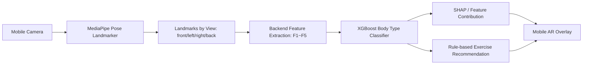

# 설명 가능한 체형 프로파일링 기반 모바일 AR 운동 추천 플랫폼

이 저장소는 논문 **「설명 가능한 체형 프로파일링 기반 모바일 AR 개인화 운동 추천 시스템」**에서 제시한 시스템을 그대로 플랫폼 구조로 옮긴 프로토타입입니다. 스마트폰 단일 카메라로 수집한 자세 랜드마크를 기반으로 체형 특징 `F1~F5`를 계산하고, XGBoost 기반 체형 유형 분류와 SHAP 기반 설명, 체형 유형별 단계적 운동 추천, 모바일 AR 오버레이 화면을 제공합니다.

> 본 프로젝트는 연구 프로토타입입니다. 의료 진단, 치료, 재활 처방을 대체하지 않으며 실제 사용자 적용 전 전문가 검토가 필요합니다.

## 논문 구성과 플랫폼 디렉토리 대응

| 논문 요소 | 구현 위치 | 설명 |
|---|---|---|
| 스마트폰 단일 카메라 입력 | `frontend/src/components/CameraCapture.tsx` | 모바일 브라우저 카메라, 뷰별 캡처 |
| MediaPipe Pose 기반 관절 좌표 추출 | `frontend/src/vision/poseLandmarker.ts`, `backend/app/pose/mediapipe_adapter.py` | 웹/서버 양쪽 확장 가능 구조 |
| F1~F5 체형 특징 추출 | `backend/app/pose/feature_extractor.py` | 목 전방 이동, 어깨 말림, 좌우 어깨 비대칭, 좌우 상체 균형, 상체 굴곡 |
| 체형 프로파일링 | `backend/app/profiling/model_service.py` | XGBoost 모델 로딩, 없을 경우 규칙 기반 폴백 |
| SHAP 기반 설명 | `backend/app/explain/shap_service.py` | mean \\|SHAP\\| 및 샘플별 기여도 구조 |
| 개인화 운동 추천 | `backend/app/recommendation/exercise_rules.py` | Release-Activate-Strengthen 3단계 추천 |
| AR 운동 안내/결과 오버레이 | `frontend/src/components/AROverlay.tsx`, `ResultPanel.tsx` | 특징선, 체형 결과, 추천 운동 시각화 |
| 예비 실험/학습 | `backend/scripts/train_xgboost.py` | Kaggle 또는 CSV 특징 데이터 기반 학습 |

## 전체 아키텍처



## 빠른 실행

### 1) 백엔드 실행

```bash
cd backend
python -m venv .venv
source .venv/bin/activate  # Windows: .venv\\Scripts\\activate
pip install -r requirements.txt
uvicorn app.main:app --reload --host 0.0.0.0 --port 8000
```

브라우저에서 `http://localhost:8000/docs`로 API 문서를 확인할 수 있습니다.

### 2) 프론트엔드 실행

```bash
cd frontend
npm install
npm run dev -- --host 0.0.0.0
```

모바일 기기에서 같은 네트워크의 개발 PC IP로 접속하면 카메라 기반 캡처 화면을 사용할 수 있습니다.

### 3) Docker Compose 실행

```bash
docker compose up --build
```

- Backend: `http://localhost:8000`
- Frontend: `http://localhost:5173`

## MediaPipe 모델 파일

프론트엔드에서 실제 Pose Landmarker를 실행하려면 `frontend/public/models/pose_landmarker_lite.task` 파일을 배치해야 합니다. MediaPipe Pose Landmarker는 이미지/비디오에서 신체 랜드마크를 출력하는 태스크이며, 웹과 Python용 안내가 제공됩니다.

## API 예시

```bash
curl -X POST http://localhost:8000/api/v1/analyze/landmarks \
  -H "Content-Type: application/json" \
  -d @data/sample_landmarks/sample_request.json
```

응답에는 다음 항목이 포함됩니다.

- `features`: F1~F5 체형 특징값
- `body_type`: 유형 A~D
- `probabilities`: 유형별 확률 또는 규칙 기반 점수
- `explanations`: 특징 기여도와 자연어 설명
- `recommendations`: Release, Activate, Strengthen 단계별 운동

## 체형 유형 정의

| 유형 | 논문 기준 설명 | 주요 특징 |
|---|---|---|
| A | 어깨 말림 우세형 | F2가 상대적으로 큼 |
| B | 목 전방 돌출 우세형 | F1이 상대적으로 큼 |
| C | 좌우 비대칭 동반형 | F3, F4가 상대적으로 큼 |
| D | 전반적 상체 굴곡형 | F5가 상대적으로 큼 |

## 학습 데이터 포맷

`backend/scripts/train_xgboost.py`는 아래 CSV 형식을 기대합니다.

```csv
F1_forward_head,F2_rounded_shoulder,F3_shoulder_asymmetry,F4_lateral_balance,F5_trunk_flexion,label
0.42,0.20,0.26,0.10,0.18,B
```

모델이 없는 경우 API는 논문에서 설명한 “특징 우세 패턴” 기준의 규칙 기반 분류로 동작합니다.

## 주요 외부 기술

- MediaPipe Pose Landmarker: 단일 이미지/비디오 기반 신체 랜드마크 출력 태스크
- XGBoost: 분류 모델 학습 및 추론
- SHAP TreeExplainer: 트리 기반 모델 예측 설명

## 권장 개발 순서

1. `sample_request.json`으로 백엔드 분석 API 동작 확인
2. 실제 모바일 카메라로 4개 뷰 캡처
3. Kaggle 또는 자체 수집 데이터에서 F1~F5 CSV 생성
4. `train_xgboost.py`로 모델 학습
5. SHAP 설명 및 AR 오버레이 사용성 평가

## 라이선스/데이터 주의

- 공개 데이터셋은 원 라이선스에 따라 별도 다운로드 후 `data/raw/`에 배치하세요.
- 본 저장소에는 논문 내용을 플랫폼화하기 위한 코드와 샘플 JSON만 포함되어 있습니다.
